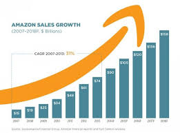

# Amazon Sales Analysis Using MySQL

* Note: Check out the .pptx file to get clear view of the project 
 [Download the PowerPoint](./SQL%20Capstone%20Project.pptx)

# Purposes Of The Capstone Project
The major aim of this project is to gain insight into the sales data of Amazon to understand the different factors that affect sales of the different cities and their corrosponding branches of Amazon located in Myanmar, using MySQL. The project aims to uncover insights into sales trends, customer behavior, and product performance. By leveraging the power of MySQL queries, we extract meaningful statistics and patterns from complex datasets.

# About Data:
This dataset contains sales transactions from three different branches of Amazon A, B & C respectively located in Mandalay, Yangon and Naypyitaw. The data contains 17 columns (Invoice Id, Branch, City, Customer Type, Gender, Product Line, Unit Price, Quantity, VAT, Total, Date, Time, Payment Method, Cogs, Gross Margin Percentage, Gross Income, Rating) and 1000 rows.

# Analysis List
  *  Product Analysis:

Conduct analysis on the data to understand the different product lines, the products lines performing best and the product lines that need to be improved.
  * Sales Analysis:
    
This analysis aims to answer the question of the sales trends of product. The result of this can help us measure the effectiveness of each sales strategy the business applies and what modifications are needed to gain more sales.
  * Customer Analysis:
    
This analysis aims to uncover the different customer segments, purchase trends and the profitability of each customer segment.
# Approach Used
  * Data Wrangling: This is the first step where inspection of data is done to make sure NULL values and missing values are detected and data replacement methods are used to replace missing or NULL values.

    
    1.  Build a database
    
    2.  Create a table and insert the data.
    
    3.  Select columns with null values in them. There are no null values in our database as in creating the tables, we set NOT NULL for each field, hence null values are filtered out.
    
  * Feature Engineering: This will help us generate some new columns from existing ones.

     1.  Add a new column named timeofday to give insight of sales in the Morning, Afternoon and Evening. This will help answer the question on which part of the day most sales are made.
    
     2.  Add a new column named dayname that contains the extracted days of the week on which the given transaction took place (Mon, Tue, Wed, Thur, Fri). This will help answer the question on which week of the day each branch is busiest.
    
     3.  Add a new column named monthname that contains the extracted months of the year on which the given transaction took place (Jan, Feb, Mar). Help determine which month of the year has the most sales and profit.
    
  * Exploratory Data Analysis (EDA): Exploratory data analysis is done to answer the listed questions and aims of this project.

# Business Questions To Answer:

1. What is the count of distinct cities in the dataset?
   
2. For each branch, what is the corresponding city?

3. What is the count of distinct product lines in the dataset?

4. Which payment method occurs most frequently?

5. Which product line has the highest sales?

6. How much revenue is generated each month?

7. In which month did the cost of goods sold reach its peak?

8.  Which product line generated the highest revenue?

9. In which city was the highest revenue recorded?

10. Which product line incurred the highest Value Added Tax?

11. For each product line, add a column indicating "Good" if its sales are above average, otherwise "Bad."

12. Identify the branch that exceeded the average number of products sold.

13. Which product line is most frequently associated with each gender?

14. Calculate the average rating for each product line.

15. Count the sales occurrences for each time of day on every weekday.

16. Identify the customer type contributing the highest revenue.

17. Determine the city with the highest VAT percentage.

18. Identify the customer type with the highest VAT payments.

19. What is the count of distinct customer types in the dataset?

20. What is the count of distinct payment methods in the dataset?

21. Which customer type occurs most frequently?

22. Identify the customer type with the highest purchase frequency.

23. Determine the predominant gender among customers.

24. Examine the distribution of genders within each branch.

25. Identify the time of day when customers provide the most ratings.

26. Determine the time of day with the highest customer ratings for each branch.

27. Identify the day of the week with the highest average ratings.

28. Determine the day of the week with the highest average ratings for each branch.

